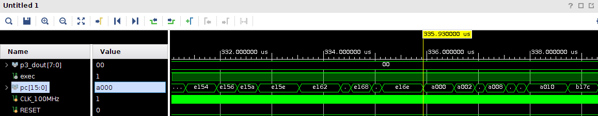
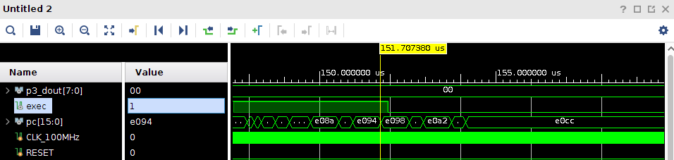

# APEX:

Modern society is increasingly surrounded by, and is growingaccustomed to, a wide range of Cyber-Physical Systems (CPS),Internet-of-Things (IoT), andsmartdevices. They often perform safety-critical functions, e.g., personal medical devices, automotive CPS as well as industrial and residential automation (e.g., sensor-alarm combinations). On the lower end of the scale, these devices are small, cheap and specialized sensors and/or actuators. They tend to be equipped with small anemic CPU, have small amounts of memory and run simple software. If such devices are left unprotected, consequences of forged sensor readings or ignored actuation commands can be catastrophic, particularly, in safety-critical settings. This prompts the following three questions:(1) How to trust data produced,or verify that commands were performed, by a simple remote embedded device?, (2) How to bind these actions/results tothe execution of expected software? and,(3) Can (1) and (2) be attained even if all software on a device could be modified and/or compromised?

In  this  work  we  answer  these  questions  by  designing, showing security of, and formally verifying, APEX: Architecture Proofs of Execution (formally known as VAPE -- we use VAPE and APEX interchangably in this repo). To the best of our knowl-edge, this is the first of its kind result for low-end embeddedsystems. Our work has a range of applications, especially, to authenticated sensing and trustworthy actuation, which are increasingly relevant in the context of safety-critical systems. APEX architecture is publicly available and our evaluation indicates that it incurs low overhead, affordable even for very low-end embedded devices, e.g., those based on TI MSP430 or AVR ATmega processors.

### APEX Directory Structure

	├── msp_bin
	├── openmsp430
	│   ├── contraints_fpga
	│   ├── fpga
	│   ├── msp_core
	│   ├── msp_memory
	│   ├── msp_periph
	│   └── simulation
	├── scripts
	│   ├── build
	│   ├── build-verif
	│   └── verif-tools
	├── simple_app
	│   └── simulation
	├── test
	│   └── simulation
	├── utils
	├── verification_specs
	│   └── soundness_and_security_proofs
	├── verifier
	├── violation_forge_ER
	│   └── simulation
	├── violation_forge_META
	│   └── simulation
	├── violation_forge_OR
	│   └── simulation
	└── vrased
		├── hw-mod
		│   └── hw-mod-auth
		└── sw-att
		    └── hacl-c

## Dependencies Installation

Environment (processor and OS) used for development and verification:
Intel i7-3770
Ubuntu 18.04.3 LTS

Dependencies on Ubuntu:

		sudo apt-get install bison pkg-config gawk clang flex gcc-msp430 iverilog tcl-dev
		cd scripts
		sudo make install

## Building VAPE Software
To generate the Microcontroller program memory configuration containing VRASED trusted software (SW-Att) and sample applications we are going to use the Makefile inside the scripts directory:

        cd scripts

This repository accompanies 4 test-cases: simple_app, violation_forge_ER, violation_forge_OR, violation_forge_META. (See [Description of Provided test-cases] for details on each test-case)
These test-cases correspond to one successfull proof of execution (PoX) and 3 cases where PoX fails due to a violation that could be used to attack the correctness of the execution.
To build VAPE for a specific test-case run:

        make "name of test-case"

For instance:

        make simple_app

to build the software including the binaries of simple_app test-case.
Note that this step will not run any simulation, but simply generate the MSP430 binaries corresponding to the test-case of choice.
As a result of the build, two files pmem.mem and smem.mem should be created inside msp_bin directory:

- pmem.mem program memory contents corresponding the application binaries

- smem.mem contains SW-Att binaries.

In the next steps, during synthesis, these files will be loaded to the MSP430 memory when we either: deploy APEX on the FPGA or run APEX simulation using VIVADO simulation tools.

If you want to clean the built files run:

        make clean

        Note: Latest Build tested using msp430-gcc (GCC) 4.6.3 2012-03-01

To test VAPE with a different application you will need to repeat these steps to generate the new "pmem.mem" file and re-run synthesis.

## Creating a VAPE project on Vivado and Running Synthesis

This is an example of how to synthesize and prototype VAPE using Basys3 FPGA and XILINX Vivado v2019.2 (64-bit) IDE for Linux

- Vivado IDE is available to download at: https://www.xilinx.com/support/download.html

- Basys3 Reference/Documentation is available at: https://reference.digilentinc.com/basys3/refmanual

#### Creating a Vivado Project for VAPE

1 - Clone this repository;

2 - Follow the steps in [Building VAPE Software](#building-VAPE-software) to generate .mem files for the application of your choice.

2- Start Vivado. On the upper left select: File -> New Project

3- Follow the wizard, select a project name and location. In project type, select RTL Project and click Next.

4- In the "Add Sources" window, select Add Files and add all *.v and *.mem files contained in the following directories of this reposiroty:

        openmsp430/fpga
        openmsp430/msp_core
        openmsp430/msp_memory
        openmsp430/msp_periph
        /vrased/hw-mod
        /msp_bin

and select Next.

Note that /msp_bin contains the pmem.mem and smem.mem binaries, generated in step [Building VAPE Software].

5- In the "Add Constraints" window, select add files and add the file

        openmsp430/contraints_fpga/Basys-3-Master.xdc

and select Next.

        Note: this file needs to be modified accordingly if you are running VAPE in a different FPGA.

6- In the "Default Part" window select "Boards", search for Basys3, select it, and click Next.

        Note: if you don't see Basys3 as an option you may need to download Basys3 to your Vivado installation.

7- Select "Finish". This will conclude the creation of a Vivado Project for VAPE.

Now we need to configure the project for systhesis.

8- In the PROJECT MANAGER "Sources" window, search for openMSP430_fpga (openMSP430_fpga.v) file, right click it and select "Set as Top".
This will make openMSP430_fpga.v the top module in the project hierarchy. Now its name should appear in bold letters.

9- In the same "Sources" window, search for openMSP430_defines.v file, right click it and select Set File Type and, from the dropdown menu select "Verilog Header".

Now we are ready to synthesize openmsp430 with VAPE's hardware the following step might take several minutes.

10- On the left menu of the PROJECT MANAGER click "Run Synthesis", select execution parameters (e.g, number of CPUs used for synthesis) according to your PC's capabilities.

11- If synthesis succeeds, you will be prompted with the next step to "Run Implementation". You *do not* to "Run Implementation" if you only want simulate VAPE.
"Run implementation" is only necessary if your purpose is to deploy VAPE on an FPGA.

If you want to deploy VAPE on an FPGA, continue following the instructions on [Deploying VAPE on Basys3 FPGA].

If you want to simulate VAPE using VIVADO sim-tools, continue following the instructions on [Running VAPE on Vivado Simulation Tools].

## Running VAPE on Vivado Simulation Tools

After completing the steps 1-10 in [Creating a Vivado Project for VAPE]:

1- In Vivado, click "Add Sources" (Alt-A), then select "Add or create simulation sources", click "Add Files", and select everything inside openmsp430/simulation.

2- Now, navigate "Sources" window in Vivado. Search for "tb_openMSP430_fpga", and *In "Simulation Sources" tab*, right-click "tb_openMSP430_fpga.v" and set its file type as top module.

3- Go back to Vivado window and in the "Flow Navigator" tab (on the left-most part of Vivado's window), click "Run Simulation", then "Run Behavioral Simulation".

4- On the newly opened simulation window, select a time span for your simulation to run (see times for each default test-case below) and the press "Shift+F2" to run.

5- In the green wave window you will see values for several signals. The imporant ones are "exec", and "pc[15:0]". pc cointains the program counter value. exec corresponds to the value of VAPE's exec flag, as described in the paper.

In Vivado simulation, for all test-cases provided by default, the final value of pc[0:15] should correspond to the instruction address inside "success" function (i.e., the program should halt inside "success" function).

To determine the address of an instruction, e.g, addresses of the "success" function as well start and end addresses of ER (values of ER_min and ER_max, per VAPE's paper) one can check the compilation file at scripts/tmp-build/XX/vrased.lst  (where XX is the name of the test-case, i.e., if you ran "make simple_app", XX=simple_app). In this file search for the name of the function of interest, e.g., "success" or "dummy_function", etc.

#### NOTE: To simulate a different test-case you need to re-run "make test-case_name" to generate the corresponding pmem.mem file and re-run the synthesis step (step 10 in [Creating a Vivado Project for VAPE]) on Vivado. 

## Deploying VAPE on Basys3 FPGA

1- After Step 10 in [Creating a Vivado Project for VAPE], select "Run Implementation" and wait until this process completes (typically takes around 1 hour).

2- If implementation succeeds, you will be prompted with another window, select option "Generate Bitstream" in this window. This will generate the bitstream that is used to step up the FPGA according to VRASED hardware and software.

3- After the bitstream is generated, select "Open Hardware Manager", connect the FPGA to you computer's USB port and click "Auto-Connect".
Your FPGA should be now displayed on the hardware manager menu.

        Note: if you don't see your FPGA after auto-connect you might need to download Basys3 drivers to your computer.

4- Right-click your FPGA and select "Program Device" to program the FPGA.

## Description of Provided test-cases

#### 1- simple_app:

Corresponds to a toy proof of execution, i.e., (1) execute "dummy_function", (2) compute proof of execution token via attestation.

At the end of simple_app's simulation, attestation resulst in the correct authenticated token value: "3622822327FC4E8FE649D44CB964E98C50050446364925B10D533BE831706064".

This corresponds to attestation (HMAC-SHA256) computed over memory containg exec value 1 (valid proof of execution).
See utils/get_token_simple_app.py for how this token is generated.

NOTE: Attestation computation takes 753ms of simulation. Simulation of 753ms may take up to an hour to complete. Zooming out the the waves windows can help in speeding up the process.

#### 2- violation_forge_ER:

Corresponds to a test-case where code in region ER is overwritten after its execution, exec_flag value switches to 0 due to the violation.

It should take less than 1ms of simulation to visualize this effect.

#### 3- violation_forge_OR:

Corresponds to a test-case where result in OR region is overwritten after ER executed. It should take less than 1ms to complete this simulation.

It should take less than 1ms of simulation to visualize this effect.

#### 4- violation_forge_META:

Corresponds to a test-case where METADATA value is overwritten after ER executed. It should take less than 1ms to complete this simulation.

It should take less than 1ms of simulation to visualize this effect.

#### 5- Examples of simulation test-cases are provided below.

- Simulation window for a valid PoX with simple_app test-case. exec_flag remains 1 until the start of attestation (PC=E000 is the first instruction in attestation code):

- Simulation window for a Violation example. Violation occurs at instruction PC=E098 causing exec_flag to switch to 0: 

#### FPGA Runs

If you are running these test-cases on the Basys3 FPGA, by default "exec_flag" is hard-wired to LED8.
In "simple_app", LED8 should remain ON (exec_flag=1, i.e., valid proof of execution).
In "violation_forge_*", LED8 should turn OFF (exec_flag=1, i.e., valid proof of execution).

#### NOTE: To simulate (or run a test with and FPGA) using a different test-case you need to re-run "make test-case_name" to generate the corresponding pmem.mem file and re-run the synthesis step (step 10 in [Creating a Vivado Project for VAPE]) on Vivado.

## Running VAPE Verification

To check HW-Mod against VRASED and VAPE LTL subproperties using NuSMV run:

        make verify

Note that running make verify proofs may take several minutes (Time may very widely depending on the setup, e.g., 22 minutes on a Ubuntu18 VM with 4 cores and 4GB of RAM).

To run VAPE and VRASED end-to-end implementation proofs check the readme file in:

        verification_specs/soundness_and_security_proofs

To run end-to-end proofs you also need to install Spot: https://spot.lrde.epita.fr/install.html
